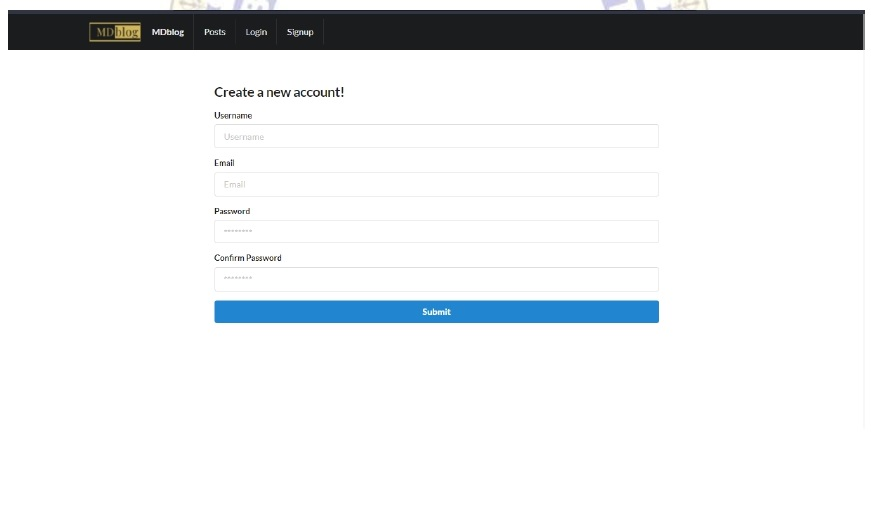
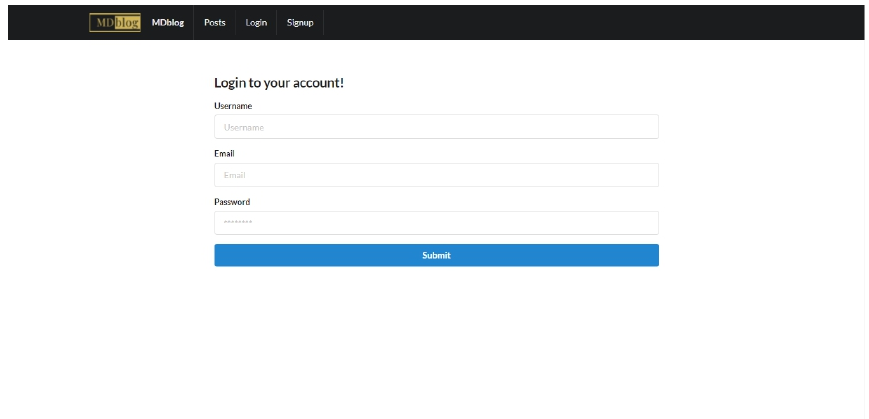
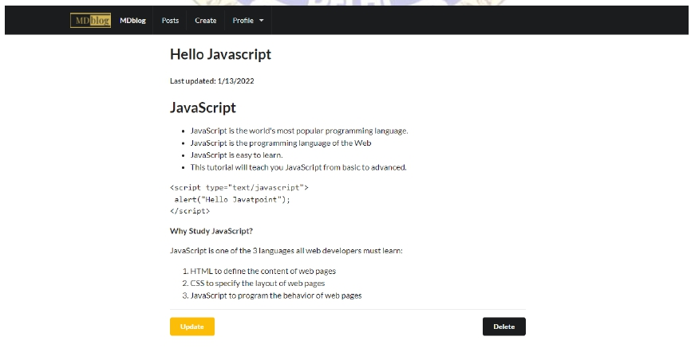
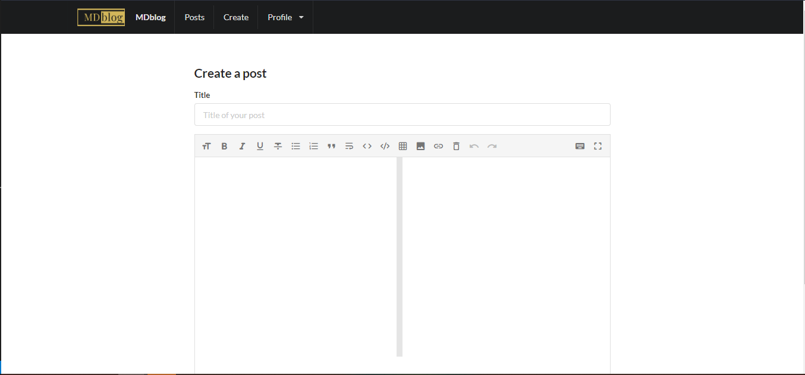

# MDblog

Markdown Blog Application is a multi-user JavaScript CRUD application.
The app allows authors to create, modify and delete posts in which content is written in
markdown. The Markdown syntax is the information that your tool holds about the
text which can be read easily in plain text before rendered by HTML. This
application provides semantic meaning for content in a relatively simple way by
allowing write rich formatted content extremely quickly. The front end of the
application is what runs in the user's browser. It is implemented with the standard
web technologies of HTML, CSS, JavaScript, and ReactJS. The backend which
runs on servers are constructed using the application of Django REST Framework
and data is stored in PostgreSQL database.

##

## Markdown Blog Application features:

> 🍬 User login and signup and saving their credentials on postgresql database!

> 🍬 Creating posts using markdown content!

> 🍬 Rendering markdown as html and displaying that as human readable text with proper styling

##

## IMAGES:

1. Sign up Screen
   

2. Sign in Screen
   

3. Create a post Screen
   

4. Blog Screen
   
